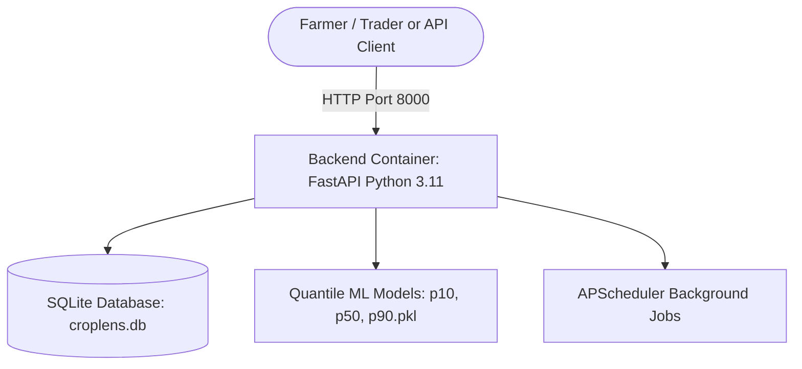

# CropLens AI — Production Deployment & Cloud Staging Guide

This guide provides step-by-step instructions for running CropLens AI locally via Docker Compose and deploying it to free/low-cost cloud staging platforms.

---

## 1. System Architecture & Container Topology



### Components:
* **Backend (`croplens_backend`):** Python 3.11-slim, Uvicorn, FastAPI, LightGBM, PyTorch, APScheduler.
* **Database:** Embedded SQLite database (`croplens.db`) with Docker volume persistence.

---

## 2. Local Deployment via Docker Compose

### Prerequisites
* Docker Engine 20.10+ and Docker Compose v2+ installed.
* A provisioned production model bundle containing `registry.json`, the versioned P10/P50/P90 artifacts, `model_metadata.json`, and `isolation_forest.pkl`. These binaries are intentionally excluded from GitHub and must be supplied on the deployment host.
* Reachable Redis in production for shared OTP storage and distributed rate limiting. The in-memory fallback is development-only.

### Quick Start (Single Command)
To build and launch the entire CropLens AI stack in background mode:

```bash
# Build and start all services
docker compose up --build -d
```

### Access Points
* **Fresh frontend:** Not currently included; it will be added after the backend API contract is finalized.
* **FastAPI Backend Swagger Docs:** [http://localhost:8000/docs](http://localhost:8000/docs)
* **Backend Health Check:** [http://localhost:8000/health](http://localhost:8000/health)

### Monitoring & Maintenance Commands

```bash
# Check running container statuses & healthcheck results
docker compose ps

# View live consolidated logs
docker compose logs -f

# View backend logs only
docker compose logs -f backend

# Stop all containers
docker compose down

# Stop and remove volumes (clean reset)
docker compose down -v
```

---

## 3. Zero-Cost Cloud Staging Deployment Options

CropLens AI is completely self-contained with no paid cloud dependencies. You can deploy it to any of the following free-tier cloud platforms:

### Option A: Render.com (Free Web Services)
1. **Backend Service:**
   * Provision the model bundle outside Git and set `MODEL_REGISTRY_PATH` to its `registry.json` path. The directory containing the registry must also contain the versioned quantile artifacts and auxiliary `isolation_forest.pkl`.
   * Set `DATABASE_URL` to the writable persistent database location for the service and set `REDIS_URL` to a reachable Redis instance.
   * Create a new **Web Service** pointing to your GitHub repository.
   * Environment: `Docker` (select root `Dockerfile`).
   * Port: `8000`.
   * Add Environment Variables:
     * `CORS_ORIGINS`: `https://your-frontend.onrender.com`
     * `PYTHONUNBUFFERED`: `1`
2. **Frontend:** Not included in the current backend-only deployment. Add the fresh frontend as a separate static service after its API integration is finalized.

---

### Option B: Railway.app (Free Hobby Tier)
1. Link your GitHub repo to a new Railway project.
2. Railway will detect `docker-compose.yml` and provision the backend service.
3. Add the fresh frontend separately after it has been implemented and tested.

---

### Option C: Hugging Face Spaces (Docker SDK — 100% Free CPU Tier)
1. Create a new Space on Hugging Face with the **Docker** SDK.
2. Push the repository. Hugging Face builds and hosts the full multi-quantile forecasting engine for free with high uptime and public sharing links.

---

### Option D: Fly.io (Free / Low Cost)
1. Launch backend:
   ```bash
   fly launch --dockerfile Dockerfile --port 8000
   ```
2. The frontend is not included in this backend-only deployment. Deploy it separately after the fresh UI is implemented.

---

## 4. Environment Variables Reference

| Variable | Default Value | Description |
|---|---|---|
| `PORT` | `8000` | Port for the Uvicorn FastAPI server |
| `CORS_ORIGINS` | `http://localhost:5173,http://localhost:3000` | Allowed CORS origins for browser security |
| `TELEGRAM_BOT_TOKEN` | *(Optional)* | Telegram Bot API Token for live automated push alerts |
| `JWT_SECRET_KEY` | *(Production Secret)* | Secret key for signing JWT user access tokens |
| `DATABASE_URL` | `sqlite:///./backend/app/croplens.db` locally; explicit container path in Compose | SQLAlchemy database connection string |
| `MODEL_REGISTRY_PATH` | Repository model registry by default | Optional path to a separately provisioned `registry.json` model bundle |
| `REDIS_URL` | `redis://localhost:6379/0` | Redis endpoint; required in production |

---

## 5. Production Health Verification Checklist

Before presenting or submitting your project:
- [ ] Verify `docker compose ps` shows `croplens_backend` with status `healthy`.
- [ ] Query `http://localhost:8000/health` $\to$ returns `"status": "healthy"`.
- [ ] Query `http://localhost:8000/api/v1/system/scheduler-status` $\to$ returns the expected background-job status.
- [ ] Query the forecast endpoint and verify that the response contains live backend-derived values, not mock data.
- [ ] Add frontend-specific checks only after the fresh frontend is implemented.
